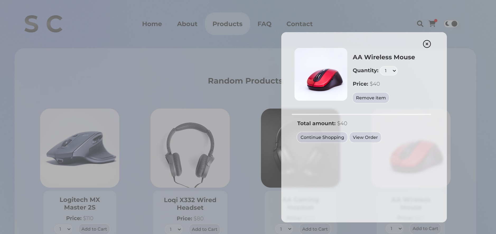
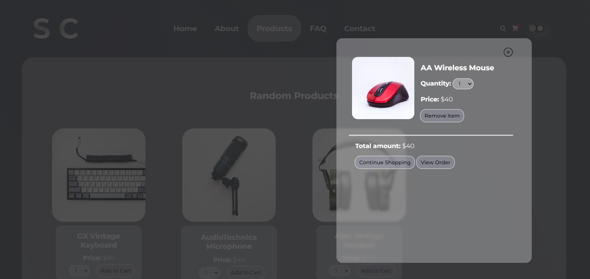

# Shopping-Cart-HTML-CSS-Javascript

Simple Shopping Cart using local storage written in vanilla HTML, CSS and Javascript
This is completed as part of Generation Australia Technical Coding Challenge.

## Screenshot:

 

## Instructions:

Create a simple shopping cart as a web app. You may use JavaScript libraries but they are not a requirement, HTML/CSS and Vanilla JS are sufficient.

### This app should satisfy the following minimum requirements:

1. Have a pre-populated (hard coded) array of objects as products.
2. Your product display should have (not limited to) product image, product name, product price
3. All products should be displayed when the page loads
4. Using an ‘add to cart’ button, the user should be able to add the products to a shopping cart list
5. The shopping cart lists all products and displays a the total price

### Stretch Goals

6. The user should also be able to delete the products from the cart, thus modifying the total price of the cart
7. The user should be able to enter a quantity for each product

## Requirements:

- The code should be readable, reusable, and easy to modify. We're looking for production quality code.
- A detailed Readme file which includes the following:
  - Setup instructions - Write out all of the steps to run your app locally
  - Discussion of technologies used - Make a list of the technologies you used including frameworks and libraries.
- A section describing the requirements and how you met them.

## Instructions to run app locally

1. Open the folder that contains the Shopping Cart HTML, CSS and JS file
2. Double click on the 'index.html' file

## How requirements are met

1. Hard coded array of objects in Javascript file - line 13 to 63
2. All product displays image, name, price and quantity
3. All products are shown under 'Products By Category' when page loads, and user can select any category to filter products
4. User able to click add to cart, depending on quantity will be added to cart accordingly.
5. Products added to cart will display a total price for each product depending on quantity, and a total price section at the bottom of the cart modal that adds up all the product prices in the cart.
6. User is able to delete any product from the cart and will be removed visually and from local storage. Total price will adjust accordingly.
7. User is able to modify the quantity and all relevant information will update.

In addition to meeting requirements, this web app is also mobile responsive and has an added feature of light/dark mode.
